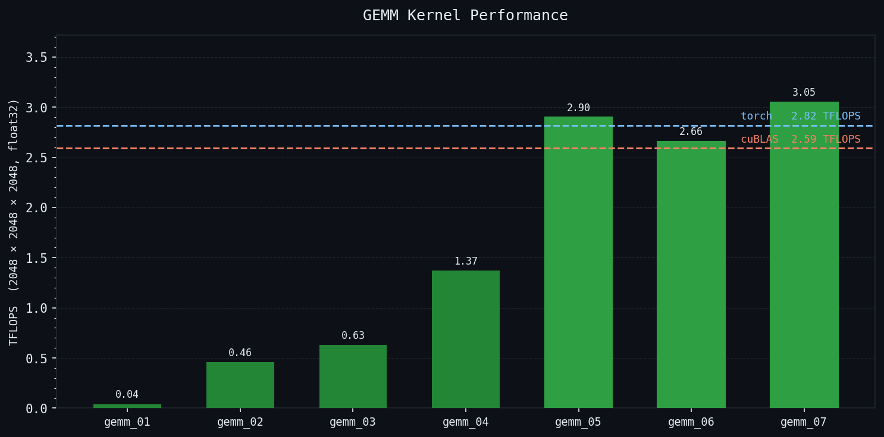
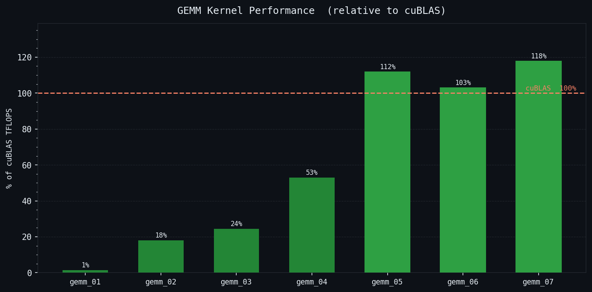

# CUDA GEMM Optimization

Implemented following Lei Mao's [CUDA Matrix Multiplication Optimization](https://leimao.github.io/article/CUDA-Matrix-Multiplication-Optimization/) guide — a progressive study of GEMM kernels in CUDA, advancing from a naive implementation to a Tensor Core-accelerated kernel that approaches cuBLAS performance.

Additions beyond the guide: Python/CUDA bindings via nanobind and a Bayesian hyperparameter optimization framework for finding peak TFLOPS across matrix configurations.

## Results  *(2048 × 2048 × 2048, float32)*




| Kernel | TFLOPS | % of cuBLAS |
|--------|--------|-------------|
| gemm_01 | 0.04 | 1.4% |
| gemm_02 | 0.46 | 17.9% |
| gemm_03 | 0.63 | 24.4% |
| gemm_04 | 1.37 | 53.0% |
| gemm_05 | 2.90 | **111.8%** |
| gemm_06 | 2.66 | 102.9% |
| gemm_07 | 3.05 | **117.7%** |
| cuBLAS  | 2.59 | 100% |
| torch   | 2.82 | — |

---

## Kernels

| Kernel | Technique | Key Idea |
|--------|-----------|----------|
| `gemm_01` | Naive parallelism | One thread per output element, all reads from global DRAM |
| `gemm_02` | Grid layout | Swapped `blockIdx.x/y` to study coalescing impact |
| `gemm_03` | Shared memory tiling | Cooperative tile loads to reduce global memory traffic |
| `gemm_04` | 1D thread tiling | Each thread computes 8 output elements; register-cached B |
| `gemm_05` | 2D thread tiling | Each thread owns an 8×8 output tile; both A and B register-cached |
| `gemm_06` | Vectorized + transposed | `int4` vectorized loads, transposed A in shared memory to eliminate bank conflicts |
| `gemm_07` | Warp-level tiling | Hierarchical tiling at block → warp → thread level; fully vectorized |
| `gemm_08` | Tensor Cores (WMMA) | NVIDIA `mma.h` WMMA API; 16×16×16 matrix fragments on dedicated hardware |

---

## Optimization Progression

```
Memory Hierarchy Exploitation
──────────────────────────────────────────────────────────────────
gemm_01  ████░░░░░░░░░░░░░░░░  Global DRAM only
gemm_03  ████████░░░░░░░░░░░░  + Shared memory tiles
gemm_05  ████████████░░░░░░░░  + Register-cached thread tiles
gemm_06  ████████████████░░░░  + Vectorized loads, bank-conflict-free
gemm_07  ██████████████████░░  + Warp-level scheduling
gemm_08  ████████████████████  + Tensor Core hardware (WMMA)
```

---

## Technical Highlights

### Shared Memory Tiling (gemm_03)
Threads cooperatively load 32×32 tiles of A and B into shared memory before computing. Reduces global memory reads from O(m·n·k) to O(m·n·k / TILE_SIZE).

### Register-Level Tiling (gemm_05)
Each thread accumulates an 8×8 register tile, loading slices of A and B from shared memory once per K-step and reusing them across all 64 output elements. Maximizes arithmetic intensity.

### Vectorized Loads + Bank Conflict Avoidance (gemm_06)
- **`int4` loads**: Each memory transaction fetches 4 floats (128 bits) in a single instruction, saturating memory bandwidth.
- **Transposed A in shared memory**: A is stored as `[K][Y + skew]` — the transpose eliminates shared memory bank conflicts during the inner product loop.
- **Skew padding**: A compile-time skew offset ensures that all 32 warp threads access distinct banks simultaneously.

### Warp-Tiled Hierarchy (gemm_07)
Introduces a three-level tiling structure:

```
Block tile:  128 × 128
  └── Warp tile:  32 × 64   (8 warps per block)
        └── Thread tile:  8 × 8   (32 threads per warp)
```

Each warp is responsible for a contiguous 32×64 output region, improving L1/shared memory locality and instruction-level parallelism within the warp.

### Tensor Core Acceleration (gemm_08)
Uses the WMMA (Warp Matrix Multiply-Accumulate) API to issue 16×16×16 matrix operations directly on NVIDIA Tensor Cores:

```cpp
nvcuda::wmma::fragment<matrix_a, 16, 16, 16, half, row_major> a_frag;
nvcuda::wmma::fragment<matrix_b, 16, 16, 16, half, col_major> b_frag;
nvcuda::wmma::fragment<accumulator, 16, 16, 16, float>         acc_frag;

wmma::load_matrix_sync(a_frag, A_smem_ptr, ...);
wmma::load_matrix_sync(b_frag, B_smem_ptr, ...);
wmma::mma_sync(acc_frag, a_frag, b_frag, acc_frag);
```

Tensor Cores execute the 16×16×16 MMA as a single hardware instruction, delivering an order-of-magnitude throughput increase over scalar FMA operations.

---

## Bayesian Hyperparameter Optimization

`optimize.py` uses **Gaussian Process minimization** (`scikit-optimize`) to find the matrix dimensions `(m, n, k)` that maximize TFLOPS for each kernel:

```python
result = gp_minimize(
    objective,          # returns -TFLOPS
    [Integer(256, 4096, name="m"),
     Integer(256, 4096, name="n"),
     Integer(256, 4096, name="k")],
    n_calls=100,
    n_initial_points=10,
)
```

The GP model balances exploration vs. exploitation across 100 evaluations, converging on configurations where each kernel performs best — rather than reporting performance at a single arbitrary size.

---

## Python Bindings via nanobind

All kernels are exposed to Python through [nanobind](https://github.com/wjakob/nanobind), with automatic `.pyi` stub generation for IDE type support:

```python
import CudaKernels

params = CudaKernels.GemmParams[float](
    m=2048, n=2048, k=2048,
    alpha=1.0, A=a, lda=2048,
    B=b, ldb=2048,
    beta=0.0, C=c, ldc=2048,
)
CudaKernels.launch_gemm_07(params)
```

The CMake build system compiles each `.cu` file into a nanobind extension module and generates stubs via `nanobind.stubgen` as a post-build step.

---

## Project Structure

```
gemm/
├── src/
│   ├── CudaKernels/
│   │   ├── gemm_01.cu  …  gemm_08.cu   # CUDA kernels
│   │   ├── cublas.cu                    # cuBLAS baseline wrapper
│   │   ├── CMakeLists.txt
│   │   └── __init__.py                  # Python module interface
│   ├── benchmark.py                     # GPU timing via CUDA Events
│   ├── optimize.py                      # Bayesian TFLOPS optimization
│   └── main.py                          # Benchmark runner
```

---

## Build

```bash
# Prerequisites: CUDA Toolkit, CMake ≥ 3.27, Python 3.14, nanobind
cmake -S src/CudaKernels -B build -DCMAKE_BUILD_TYPE=Release
cmake --build build -j$(nproc)
```

Run benchmarks:

```bash
cd src
python main.py
```

---

## Concepts Demonstrated

- CUDA thread/block/grid hierarchy and occupancy reasoning
- Shared memory tiling and synchronization (`__syncthreads`)
- Register file pressure management and loop unrolling (`#pragma unroll`)
- Memory coalescing and vectorized global memory access (`int4`)
- Shared memory bank conflict analysis and mitigation (skew padding, transposition)
- Warp-level parallelism and scheduling
- NVIDIA Tensor Core programming (WMMA API)
- cuBLAS integration as a performance ceiling
- Python/CUDA interop via nanobind
- Bayesian optimization for performance profiling

---

## References

- Lei Mao — [CUDA Matrix Multiplication Optimization](https://leimao.github.io/article/CUDA-Matrix-Multiplication-Optimization/) — primary implementation reference for gemm_01 through gemm_07